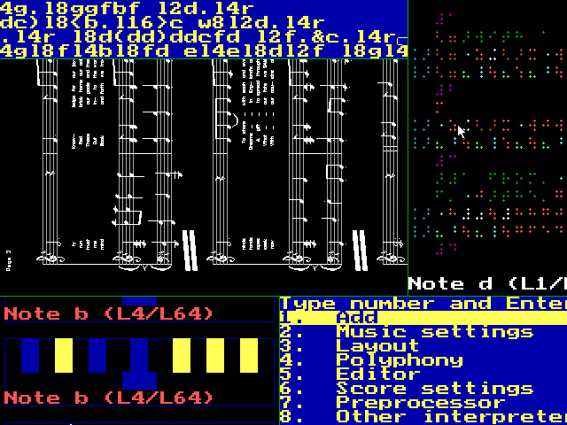

# Manuscript Writer to Lilypond converter
from https://ssb22.user.srcf.net/mwrhome
(also [mirrored on GitHub Pages](https://ssb22.gitlab.io/mwrhome) just in case)

Manuscript Writer was a C++ music notation program I made in the mid-1990s to help with school music work.  Its input was based on SMX code (e.g. `O2L4cdL8efL4g`) with many additions.

Manuscript Writer is rarely needed nowadays, because GNU Lilypond produces much better typesetting.  [mwr2ly.y](mwr2ly.y) in this repository is a mostly-automatic converter from Manuscript Writer code to Lilypond code; read the comments at the start of the file for how to compile and use it.

This repository also contains:
* [midi-add-depth.py](midi-add-depth.py) to change MIDI files to add the pan and reverb settings that Manuscript Writer would have used for different instruments,
* [lilypond-svg-fixer.py](lilypond-svg-fixer.py) to improve the display of Lilypond 2.18's SVG files in some Web browsers,
* and [size-finder.py](size-finder.py) to optimise large-print staff sizes for page-turns.

Manuscript Writer also had support for Braille music, graphical Braille tutorials and various old PC hardware and file formats, but I no longer distribute Manuscript Writer because:

1. The text-to-phonemes table for its built-in speech synthesiser was derived from a commercial BBC Micro speech program (this was supposed to be temporary while I wrote my own table, but I forgot and left it in), plus its low-level driver for Creative Labs soundcards was based on code that wasn’t mine and I’ve forgotten what the license was.  I could remove those features, but I no longer have the compiler needed by the DOS version of Manuscript Writer, so at the very least I have to discontinue the DOS version.
2. The Unix version lacks the support for various esoteric DOS devices and fancy user interfaces, and the only thing it does that’s still special is Braille output, but:
3. Manuscript Writer’s Braille is now out of date: the various Braille authorities agreed on a new international standard just after the time I stopped working on Manuscript Writer, and the number of people wanting their Braille music to be done in the old style has now dwindled.  Anyway, if Braille conversion is what you want then you are probably better off finding a program that reads a more standard input format.  Manuscript Writer has its own language and can also import a bunch of other formats, but all of these are quite old and no longer widely used (except the ones it doesn’t handle very accurately), and it might be quicker to write the Braille yourself unless you also want print at the same time.

If anyone is desperate then I could ship a version of Manuscript Writer with the dubious parts removed but it will have to be Unix.  Meanwhile I highly recommend Lilypond, and I hope Lilypond’s Braille support is coming soon.

## Director Musices with Lilypond “Howto”
This is what worked for me:

1. Download the GNU/Linux (actually generic Unix) version of Director Musices [from Internet Archive](https://web.archive.org/web/20220302222249/http://www.speech.kth.se/music/performance/download/dm25a.tgz)
2. Download CMU Lisp (or your package manager might have `cmucl`)
3. Set the correct full path in the `dm/lib/make-dm1-cmulisp.lsp` file
4. Be in the `dm` directory, and do `lisp -load $(pwd)/lib/make-dm1-cmulisp.lsp`
5. When the menu is displayed, select option 2 and type in the full pathname of Lilypond’s MIDI output (*without* putting quotes around it, contrary to what the prompt seems to suggest)
6. If you get errors like “The value of PCL::NEW-VALUE is NIL”, keep entering 0 until you get back to the Director Musices menu
7. Select option 3 and type `rulepalettes/default.pal`
8. Select option 7 or 8 and type a pathname for the output MIDI file
9. Select `q`, and type `(quit)` at the Lisp prompt

An “expect” script could be used as a quick way of automating this, or you could go into the Lisp internals.

You can then use my [Python hack to add pan and reverb](midi-add-depth.py) to Director Musices’ output if your version of Director Musices doesn’t implement it already.

Note that Director Musices may delete any expression information that Lilypond itself has added, so it is not advisable for use on pieces where Lilypond has many dynamic marks to play. 

## Anecdotes
You might find these entertaining:

* One of the formats for outputting a score was in HP’s plotter language, to drive the school’s laser printer before I figured out its raster mode.  But I didn’t know how to do filled solids, so I emulated them with thousands of lines, and at one point my scores were tying up the printer for 10+ minutes per page and I had to schedule them at intervals to allow others to print in between, which led to a lot of running around fetching and collating pages.  An early version failed to issue the “finalise” command and my music was printed over the top of various hapless students’ work.
* There was also a function to broadcast MIDI events over the IPX network.  Only one of the PCs had a sound card (the others had Keynote Gold speech-synthesis cards but these could not play music), and the sound-card PC was often in use but not for its sound, so I wrote a TSR program to sit in the background and receive MIDI from whichever other PC I was using.  The person on the sound machine didn’t usually mind as long as I remembered to ask!  (I did of course try to co-ordinate a chorus of beeping PCs as well; it’s the sort of thing you do at that age.)
* There was a feature called the Graphical Orchestral Positioning System (GOPS), which let you set the virtual location of each instrument by dragging coloured boxes around with the mouse (I was never any good at graphics but I wanted to use a fancy-sounding name for some reason).
* Early versions were so bad at drawing accidentals on my inkjet printer that I added an option to miss them out and leave space for them to be penned in by hand.  It got better later, but I never did get rid of that option.
* My spelling wasn’t always good, but when I discovered I had something wrong (like “pitzicato”), I’d make a funny error message to pop up if I should make that particular mistake again.
* The “print preview” was usually rotated, because I couldn’t see the point of monitors being landscape while printouts are portrait.  I’d lean my head over to check the layout, and my father once said I’ll end up being locked in that position as an old man.  (Just as well Lilypond and larger monitors came out.)
* One complication with the Braille code was that, despite being in a specialist blind college for the last two years of my schooling (1995-97), I didn’t see a Braille ASCII table until after I had left.  I should probably have derived my own from a test run, but I didn’t think of that—I used the proprietary binary protocol of each of their Braille machines, which meant you had to match up the options to the machine you were using as well as setting the musician’s preferred parameters, and there were some very strange failure modes.  My “tutor” feature could put colour-coded dots on the screen with mouseover explanations (like Wenlin’s “instant lookup” before its time—I got the idea from Skyglobe), or it could draw diagrams showing which keys to press on a manual Braille machine (handy if I couldn’t get to use an automatic one, as for some unknown reason I never did get the hang of which key punched which dot, and could barely manage a tenth of the speed some students did).  I did get some of my compositions played but I can’t remember how many of my Braille parts were used without editing.
* My “Manuscript Writer home page” has been on the Web since 1995/96 (originally on a friend’s site, then on my own when I started one in 1997/98 although my URL had to change a few times since then); the general idea of its simple design has worked for me for many years despite what some have said about it being “out of fashion” at times. 

## Copyright and Trademarks
Copyright and Trademarks
All material © Silas S. Brown unless otherwise stated.
Linux is the registered trademark of Linus Torvalds in the U.S. and other countries.
Python is a trademark of the Python Software Foundation.
Unix is a trademark of The Open Group.
Wenlin is a trademark of Wenlin Institute, Inc. ​SPC.
Any other trademarks I mentioned without realising are trademarks of their respective holders.
